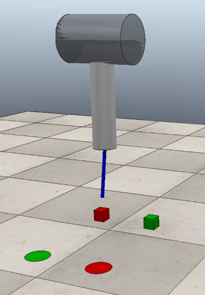

# SGM-SIM: a simulator for soft growing manipulators 

This repository contains a simulation environment of a soft growing manipulator. The simulated environment is developed using [Coppelia Sim](http://coppeliarobotics.com "Coppelia Robotics Homepage"). The simulator can be used as standalone (to develop your own application) or with a novint falcon haptic interface (shared control teleoperation code is provided).

### Reference 
If you use this code, please cite our paper: 
*F. Stroppa et al., "Shared control Paradigms on a Soft Growing Manipulator",  Submitted.*

# Preliminaries
## CoppeliaSim
Download Coppelia Sim from [this page](https://www.coppeliarobotics.com/downloads "Coppelia Robotics Download Page") or running the following command

`$ wget https://www.coppeliarobotics.com/files/CoppeliaSim_Edu_V4_1_0_Ubuntu18_04.tar.xz`

Extract to a desired location, e.g.

`$ tar -xvf ~/CoppeliaSim_Edu_V4_1_0_Ubuntu18_04.tar.xz`

Test your installation 

`$ cd ~/CoppeliaSim_Edu_V4_1_0_Ubuntu18_04; ./coppeliaSim.sh`

###Standalone use

If you want to use the soft growing manipulator simulation and develop your own application, download the scene *scenes/sgm-sim.ttt* and open it in Coppelia Sim.

###Shared control simulation

If you want to use our code to interface the simulation environment or test our shared control teleoperation architectures follow the steps below.

## Eigen
Eigen can be downloaded from [this page](http://eigen.tuxfamily.org/
index.php?title=Main_Page#Download) or cloning its repo

`$ git clone https://gitlab.com/libeigen/eigen.git`

Install Eigen with the following command

`$ cd ~/eigen; mkdir build; cd build; cmake ..; sudo make install`

## Novint Falcon
Novint Falcon libraries are at [this page](https://github.com/libnifalcon/libnifalcon). To install them, clone the repo

`$ git clone https://github.com/libnifalcon/libnifalcon.git`

`$ cd libnifalcon`

and follow [these instructions](https://github.com/libnifalcon/libnifalcon/blob/master/COMPILE.txt). 

# Build and run

Download the source code or clone this repository with the command

`$ git clone https://github.com/mrslvg/sgm-sim.git`

To build the source code

`$ cd sgm-sim/shared-control; mkdir build; cmake ..; make -j8`

To run the shared control teleoperation, simply run

`$ ./shared-control`

### Note
Make sure the Coppelia Sim is open and the scene *sgm-sim.ttt* is correctly loaded.
